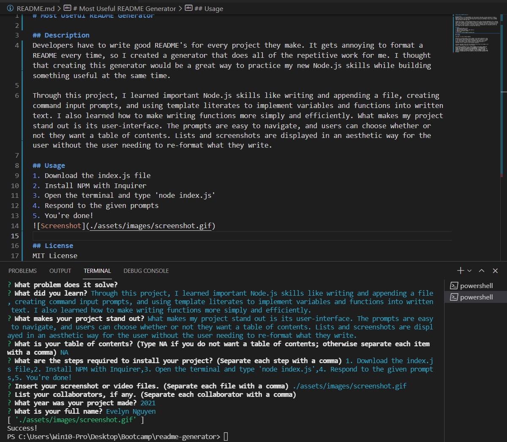

# Most Useful README Generator

## Description
Developers have to write good README's for every project they make. It gets annoying to format a README every time, so I created a generator that does all of the repetitive work for me. I thought that creating this generator would be a great way to practice my new Node.js skills while building something useful at the same time.  

Through this project, I learned important Node.js skills like writing and appending a file, creating command input prompts, and using template literates to implement variables and functions into written text. I also learned how to make writing functions more simply and efficiently. What makes my project stand out is its user-interface. The prompts are easy to navigate, and users can choose whether or not they want a table of contents. Lists and screenshots are displayed in an aesthetic way for the user without the user needing to re-format what they write.

## Usage
1. Download the index.js file
2. Install NPM with Inquirer
3. Open the terminal and type 'node index.js'
4. Respond to the given prompts
5. You're done!

## License
MIT License

Copyright (c) [2021] [Evelyn Nguyen]

Permission is hereby granted, free of charge, to any person obtaining a copy
of this software and associated documentation files (the "Software"), to deal
in the Software without restriction, including without limitation the rights
to use, copy, modify, merge, publish, distribute, sublicense, and/or sell
copies of the Software, and to permit persons to whom the Software is
furnished to do so, subject to the following conditions:

The above copyright notice and this permission notice shall be included in all
copies or substantial portions of the Software.

THE SOFTWARE IS PROVIDED "AS IS", WITHOUT WARRANTY OF ANY KIND, EXPRESS OR
IMPLIED, INCLUDING BUT NOT LIMITED TO THE WARRANTIES OF MERCHANTABILITY,
FITNESS FOR A PARTICULAR PURPOSE AND NONINFRINGEMENT. IN NO EVENT SHALL THE
AUTHORS OR COPYRIGHT HOLDERS BE LIABLE FOR ANY CLAIM, DAMAGES OR OTHER
LIABILITY, WHETHER IN AN ACTION OF CONTRACT, TORT OR OTHERWISE, ARISING FROM,
OUT OF OR IN CONNECTION WITH THE SOFTWARE OR THE USE OR OTHER DEALINGS IN THE
SOFTWARE.
